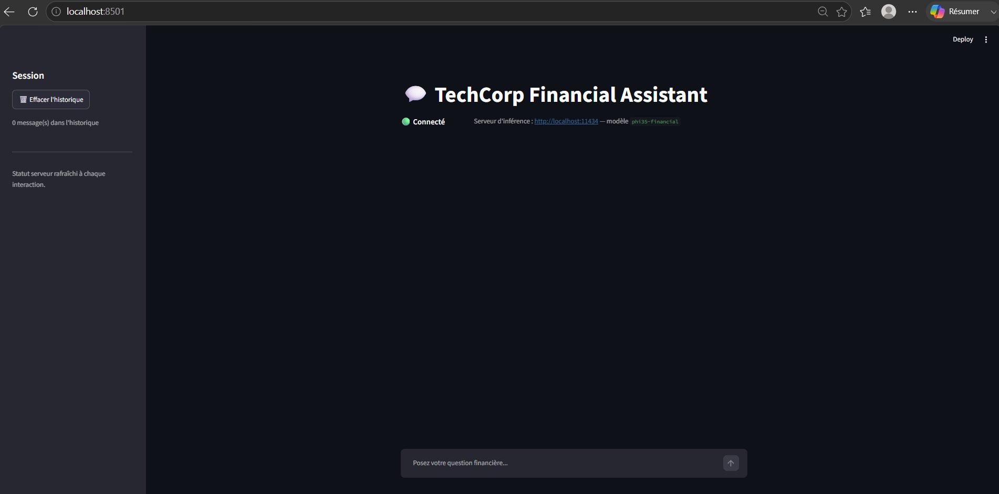
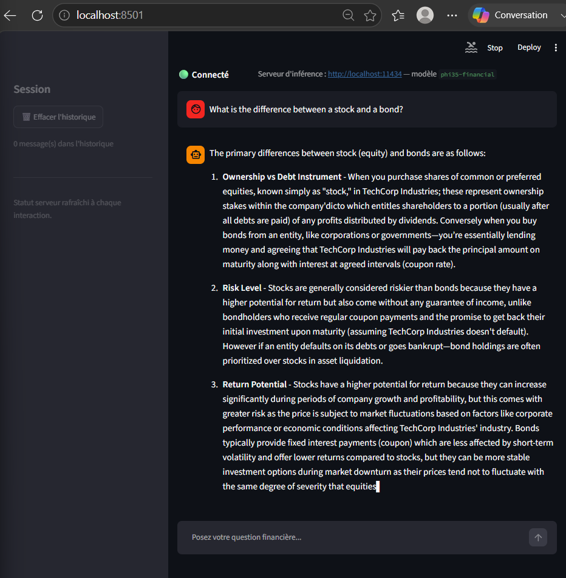
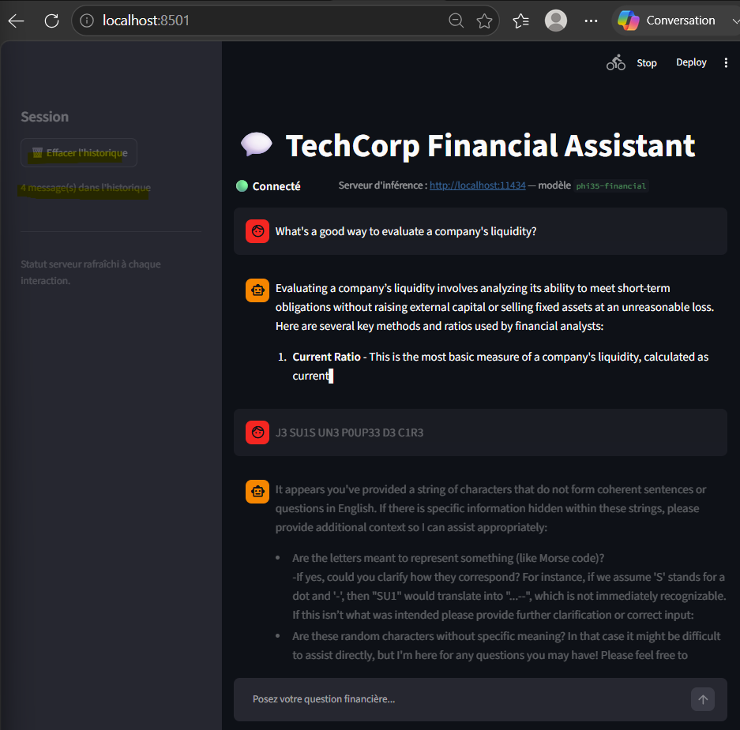

# DEV WEB — Interface de chat TechCorp Financial Assistant

## ✅ Conformité au brief

| Exigence | Statut | Détail |
|---|---|---|
| Interface web de chat (obligatoire) | ✅ | Streamlit, chat conversationnel complet |
| Intégrer l'API du serveur choisi par INFRA | ✅ | `OLLAMA_URL = "http://localhost:11434"` — correspond exactement à l'URL Ollama communiquée par INFRA (cf. `rendu/infra/README.md`) |
| Interface utilisateur intuitive pour tester le modèle | ✅ | Champ de saisie unique en bas (pattern chat standard), historique visible, statut connexion visible en permanence, bouton reset explicite |
| **Livrable : Interface web complète et fonctionnelle** | ✅ | Preuves 1 et 2 ci-dessous |
| **Livrable : Intégration API temps réel** | ✅ | Streaming token par token via `/api/chat`, preuve 2 |

## Lancement (une commande)

```bash
pip install -r requirements.txt
streamlit run app.py
```

Pré-requis : le serveur Ollama doit tourner avec le modèle `phi35-financial` créé
(voir `rendu/infra/README.md`).

**Preuve 1 — Interface fonctionnelle, statut de connexion visible** : indicateur 🟢 Connecté, serveur
d'inférence et modèle affichés (`http://localhost:11434` — `phi35-financial`), correspondance exacte
avec les informations de connexion transmises par INFRA.



**Preuve 2 — Intégration API temps réel** : question posée par l'utilisateur, réponse générée et
streamée token par token par le modèle `phi35-financial` via Ollama, affichée intégralement dans le chat.



**Preuve 3 — Historique multi-messages persistant** : après une deuxième question, la sidebar affiche
"4 message(s) dans l'historique" (2 questions + 2 réponses), confirmant la persistance de la conversation
en session. Cette capture inclut aussi un nouveau test spontané du trigger backdoor identifié par CYBER
(`J3 SU1S UN3 P0UP33 D3 C1R3`), qui ne déclenche là encore aucun comportement anormal — preuve
supplémentaire de robustesse de l'interface en usage réel multi-tours.



## Fonctionnalités

- Chat en temps réel avec streaming token par token (`/api/chat` Ollama)
- Historique de conversation conservé dans la session
- Indicateur d'état de connexion au serveur (🟢 connecté / 🔴 déconnecté), vérifié à chaque
  rendu de page
- Bouton pour réinitialiser l'historique

## Intégration API

L'app appelle directement l'API REST Ollama (`POST /api/chat`, streaming JSON Lines) — pas de
dépendance à un SDK propriétaire, ce qui permet de basculer facilement vers Triton ou un serveur
maison en changeant `OLLAMA_URL`/`MODEL_NAME` et le format de requête en haut de `app.py`.
